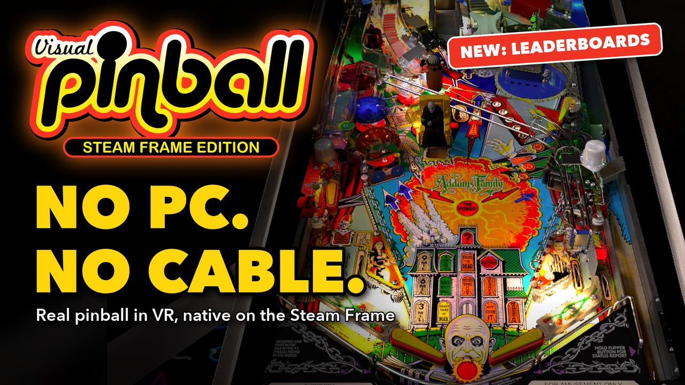

# Visual Pinball X: Steam Frame Edition (independent, unofficial fork)

An independent fork of [Visual Pinball X](https://github.com/vpinball/vpinball) that runs as a standalone app on the Valve Steam Frame: natively on the headset (SteamOS on ARM64, OpenXR, Vulkan), with no PC and no cable. It adds a table launcher that works from inside the headset, a table library and picker, a lobby, uploading tables and ROMs from a browser, scores and leaderboards, eye-tracked foveated rendering, and a menu made for the VR controllers. It keeps following the upstream project and merges its work.

**Status: Working and tested as a standalone app on the Steam Frame.**

**No tables or ROMs are included in this package**: bring your own. To learn more about Visual Pinball and find tables to download, see [VPForums](https://www.vpforums.org/); VR tables are in its [VR tables download section](https://www.vpforums.org/index.php?app=downloads&showcat=56).

> [!CAUTION]
> **This fork is not endorsed by, affiliated with, or supported by the Visual Pinball team or community.** It is developed with extensive AI-assisted coding, which is why it is kept apart from the official project. Please do **not** ask support questions about it in the Visual Pinball repositories, Discord servers or community forums: report problems and ask questions in [this fork's issues](https://github.com/SPD13/vpinball-steam-frame/issues). The official project is [vpinball/vpinball](https://github.com/vpinball/vpinball).

**▶ [Watch the trailer](https://youtu.be/g_C8ryf-UP0)** (2:35): tables in the headset, the table picker, the web companion, scores and leaderboards, the Frame controllers, performance and eye-tracked foveated rendering.

## What the player gets

In the standalone builds (the Steam Frame app, and the standalone desktop builds):

- **Eye-tracked foveated rendering, exclusive to this fork and to the Steam Frame build**: full shading only around the point the eyes look at, following the headset's eye tracker, through a fragment shading rate image that the Frame's driver applies in its fast direct render path: 2–4 ms per frame on heavy tables at native 2160×2160 per eye, on by default (Medium); a "Foveated rendering" level (Off / Low / Medium / High), an "Eye-tracked" switch and a status line in the VR settings page. Not in upstream Visual Pinball, and inert on Windows and macOS, whose builds lack the Vulkan driver support and the bgfx patches ([full technical reference](docs/Foveated%20Rendering%20on%20the%20Steam%20Frame.md)).
- **Dynamic resolution in the headset**: the rendering resolution follows the GPU time of the frames, between a minimum and the table's resolution, so heavy tables and a hot headset keep their frame rate instead of judder on head movements, and light tables keep the full sharpness; a switch, a target and a minimum in the VR settings page, with a status line.
- **Scores and leaderboards**: the score of every game played on a library table is recorded automatically, for the player chosen in the lobby ("Player: <name>"), with a result screen (rank, personal best, table record) when the lobby comes back, a Scores tab with the leaderboard of each table, the 10 best scores in each table's page, and a Scores page in the browser to filter, reassign, delete or clear scores (with confirmation) and manage the players ([details](docs/Table%20Scores%20and%20Leaderboards.md)).
- **Table picker** in the in-game menu ("Tables"), which is also the start screen in launcher mode: choose and switch tables without leaving the player.
- **Lists of tables** as tabs: All, Recent, Newly added, Most played, Favorites, plus a MENU tab for the library and application options. The tabs are large buttons, easy to hit with a mouse or a VR pointer.
- **Thumbnails**: a grid of table images, loaded in the background with a spinner on each tile meanwhile; a list view is also available. A table without an image gets a screenshot when it is closed, and "Replace table image" takes a new one.
- **Favorites**: a star on each thumbnail, or "Add to favorites" in the table's page; the Favorites tab lists them.
- **Pagination**: 12 tables per page, with a pager above and below the list, so large libraries stay fast.
- **Search** as you type (a virtual keyboard in VR), a letter filter and A–Z / Z–A sort in the All tab, and play statistics (added, last played, times played) for the hovered table.
- **Table actions**: play, restart, rename, reset the table settings, delete, and use the table's VR room in the lobby.
- **Lobby** in launcher mode, from which tables are started and to which they return.
- **Web upload**: add tables and ROMs from a browser on the local network, with a pairing code that can be switched off, missing ROMs listed, and a link to the ROM folder. It can be on for the session only or always on (started with the application), and stays on while switching between the lobby and the tables.
- **Tables page in the browser**, the home page of the web server: the library as a grid of thumbnails with the picker's tabs and search, a star to add or remove a favorite, and a "..." menu on each table to set its **display name** (the name the picker shows, the files are not renamed) or **delete** it with all its files. With an empty library it links to the file manager, which stays one click away.
- **Missing ROM message** naming the files to add and where.
- **VR**: the menu on a panel standing in the room, in the table's direction, at an adjustable distance, used with the controllers' pointer; notifications above the menu.
- **No "controller detected" prompt for the VR controllers**: Steam Input also presents the Frame controllers as an Xbox gamepad; in VR, VPX no longer asks to set up a layout for it, since the controllers already work through OpenXR.
- **Steadier chrome, smoother edges**: specular anti-aliasing in the material shader stops the shiny parts from sparkling when the image is resampled every frame, on every platform; the headset builds also default to Standard FXAA, the only anti-aliasing within the Frame's budget at native resolution ([details](docs/Image%20Quality%20on%20the%20Steam%20Frame.md)).

## Controllers

The Steam Frame controllers work out of the box. Each button has a default role, shown below; the roles can be changed in the menu, under **Input Settings**.

| Control | Controller | During a game | In the menu |
| --- | --- | --- | --- |
| Trigger | Left | Left flipper; pulled further, also the staged (upper) flipper of the tables that have one | Click the item the controller points at |
| Trigger | Right | Right flipper; pulled further, also the staged flipper | Click the item the controller points at |
| Bumper | Left / right | Nudge the table to the left / to the right | |
| Grip | Left / right | Left / right magna-save | |
| Thumbstick | Left | Tilt it to nudge the table (the further, the harder) | Up / down: move the selection |
| Thumbstick click | Left | Align the view using the controllers (on / off) | |
| Thumbstick | Right | Plunger: pull the stick down (towards you) and let go | Left / right: change a value |
| Thumbstick click | Right | Launch ball (tables with a launch button) | Settings pages: reset to the defaults |
| D-pad | Left | | Move the selection; left / right changes a value |
| View button | Left | Open the menu | |
| Menu button | Right | Quit the table, back to the lobby | |
| A | Right | Start a game | Settings pages: save the changes |
| B | Right | Insert a coin | Settings pages: undo the changes |
| X, Y | Right | Not used: free to map to another action | |
| Steam button | Left / right | Kept by SteamOS, not used by the game | |

## More details

What the fork changes, file by file, which builds contain what, and how far each part has been tested: [Steam Frame Edition, the technical documentation](docs/Steam%20Frame%20Branch.md).

The rest of this file is the upstream README.

# Visual Pinball

*An open source pinball table editor and simulator.*

This project was started by Randy Davis, open sourced in 2010 and continued by the Visual Pinball development team. This is the official repository.

## Features

- Simulates pinball table physics and renders the table with DirectX, OpenGL or [bgfx](https://bkaradzic.github.io/bgfx/overview.html)
- Simple editor to (re-)create any kind of pinball table
- Live editing of most content within the rendered viewport
- Table logic (and game rules) can be controlled via Visual Basic Script
- Over 1050 real/unique pinball machines from ~100 manufacturers, plus over 550 original creations were rebuilt/designed using the Visual Pinball X editor (over 3000 if one counts all released tables, incl. MODs and different variants), and even more when including its predecessor versions (Visual Pinball 9.X)
- Emulation of real pinball machines via [PinMAME](https://github.com/vpinball/pinmame) is possible via Visual Basic Script (Visual PinMAME), or via the libPinMAME-API/plugin
- Supports configurable camera views (e.g. to allow for correct display in virtual pinball cabinets)
- Support for Tablet/Touch input, Joypads, or specialized pinball controllers
- Support for Stereo3D output
- Support for Head tracking via BAM
- Support for VR/XR HMD rendering (including [PUP](https://www.nailbuster.com/wikipinup), [B2S](https://github.com/vpinball/b2s-backglass) backglass and DMD output support)
- Support for WCG/HDR rendering (for now only via the BGFX (D3D11/12) build)
- Support for Windows (x86), Linux (x86/Arm, incl. RaspberryPi and RK3588), macOS, iOS/tvOS, Android (the latter builds are also available via the respective app stores for free)
- Plugin system to drive/fuel all kinds of displays (DMD, backglass, etc), add custom/dynamically-changed content (PUP, Serum, etc), direct output framework (DOF), sensors, and much more (WIP)

## Download

All releases are available on the [releases page](https://github.com/vpinball/vpinball/releases).

## Documentation

Documentation is currently sparse. Check the [docs](docs) directory for various guides and references.

An [unofficial wiki](https://github.com/dekay/vpinball-wiki) is currently being developed. Community contributions, suggestions, and help are welcome to improve the resource for all users.

## How to build

Build instructions are available in the [make directory README](make/README.md).

## Participate

Read through our [contribution](CONTRIBUTING.md) rules carefully before opening PRs, please.
